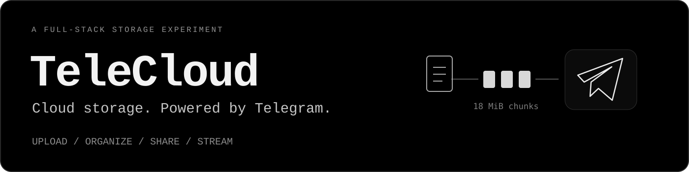
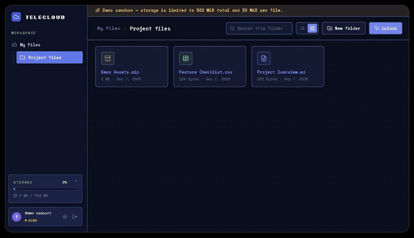
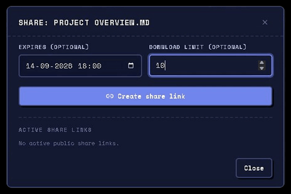
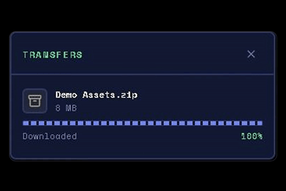
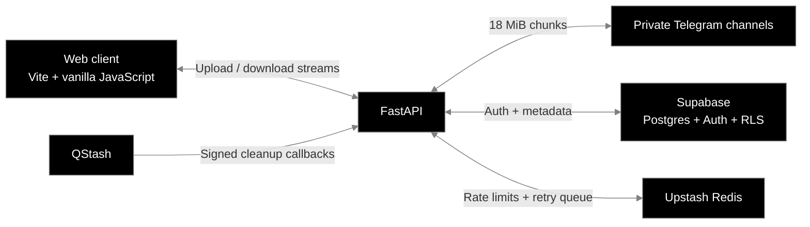

<p align="center">
  
</p>

<p align="center">
  <a href="https://tele-cloud-nine.vercel.app/"><strong>Try the live demo</strong></a>
  &nbsp; / &nbsp;
  <a href="#how-it-works">Architecture</a>
  &nbsp; / &nbsp;
  <a href="#quickstart">Quickstart</a>
  &nbsp; / &nbsp;
  <a href="#inside-the-codebase">Explore the code</a>
</p>

<p align="center">
  <code>Python 3.12</code> · <code>FastAPI</code> · <code>Supabase</code> · <code>Telegram Bot API</code> · <code>Vite</code>
</p>

TeleCloud is a full-stack file storage app with an unusual backend: **the file bytes live in private Telegram channels**. Upload files, organize folders, and share links through a familiar web interface. FastAPI handles chunked transfers; Supabase stores authentication and file metadata.

The interesting work happens underneath the file browser: publishing uploads only after their chunks are stored, reconstructing ranged downloads, respecting API rate limits, and cleaning up interrupted operations.

## See it in action

**Your files, folders, and transfers in one workspace.**

<p align="center">
  
</p>

<table>
  <tr>
    <td width="50%" valign="top">
      <h3>Share on your terms</h3>
      
      <p>Create public links with optional expiry dates and download limits. Revoke access when a link is no longer needed.</p>
    </td>
    <td width="50%" valign="top">
      <h3>Keep transfers visible</h3>
      
      <p>Track progress, speed, and ETA in the transfer panel. The API supports HTTP Range requests for resumable downloads.</p>
    </td>
  </tr>
</table>

[Open the live demo](https://tele-cloud-nine.vercel.app/) and choose **Try Demo — no account needed**. The sandbox has a 500 MiB total quota and a 30 MiB per-file limit. The hosted backend may take a moment to wake up after being idle.

## What you can do

| Capability | What it includes |
| --- | --- |
| Upload and download | Drag-and-drop uploads, up to three concurrent transfers, per-file progress, and streaming API responses. |
| Organize your drive | Nested folders; file and folder renaming, moving, and deletion; list and grid views. |
| Share a file | Public token links, optional expiration, download limits, download counting, and revocation. |
| Manage access | Supabase sign-in, email confirmation, automatic session refresh, and owner-scoped database access. |
| Recover from interruptions | Cleanup of abandoned uploads, deferred physical deletion, and a bounded retry queue. |

## How it works



### An upload, end to end

1. **Check access and quota.** Create a `pending` file record before accepting the upload into storage.
2. **Stream and split.** The backend forms fixed 18 MiB chunks and sends them through a round-robin pool of Telegram bots. Each chunk's channel, message, file, and bot identifiers are recorded in Postgres.
3. **Publish the file last.** Mark the chunks `committed`, then mark the file `committed`. File listings and downloads only expose committed files.
4. **Reclaim unfinished work.** If the upload stops partway through, the scheduled orphan sweeper reclaims its abandoned storage and records.

**Why 18 MiB?** The hosted Telegram Bot API's [`getFile` download limit is 20 MB](https://core.telegram.org/bots/api#getfile). Each chunk must be small enough to retrieve again; 18 MiB leaves room below that limit.

### The engineering underneath

- **Streaming without server-side temporary files.** Uploads are chunked incrementally. Downloads are reconstructed in order, with byte-range math selecting the relevant chunks and offsets.
- **Ownership enforced in Postgres.** User requests pass their JWT to the database so row-level security applies to file, folder, chunk, and share records.
- **Controlled public access.** Share downloads use a separate service-role path that checks revocation, expiry, and download limits before streaming.
- **Rate-limit-aware storage.** Redis coordinates request and Telegram budgets. Transient storage failures use a retry queue with a bounded attempt count.
- **Cleanup outside the request path.** QStash invokes signed, bounded cleanup jobs for abandoned uploads and soft-deleted files.

## Stack

| Layer | Tools |
| --- | --- |
| Web client | Vanilla JavaScript, Vite, Lucide icons |
| API | Python 3.12, FastAPI, Pydantic, HTTPX |
| Identity and metadata | Supabase Auth, Postgres, row-level security |
| File bytes | Telegram Bot API and private channels |
| Rate limits and retries | Upstash Redis |
| Scheduled cleanup | Upstash QStash |
| Deployment configuration | Render for the API; Vercel for the frontend |

## Quickstart

You'll need Python 3.12, Node.js/npm, a Supabase project, a Telegram bot and private channel, and Upstash Redis and QStash credentials.

### 1. Clone and install

```bash
git clone https://github.com/x4ddy/tele-cloud.git
cd tele-cloud
python -m venv .venv
```

Activate the environment with `source .venv/bin/activate` on macOS/Linux, or `.venv\Scripts\Activate.ps1` in PowerShell. Then install the backend dependencies:

```bash
python -m pip install -r requirements.txt
```

### 2. Configure the services

Copy [`.env.example`](.env.example) to `.env` and fill in the Telegram, Supabase, Upstash Redis, and QStash values. For local development, use:

```dotenv
APP_BASE_URL=http://localhost:5173
CORS_ALLOWED_ORIGINS=http://localhost:5173
APP_ENV=development
```

- **Telegram:** create a bot through BotFather, add it as an administrator to a private storage channel with permission to post and delete messages, and set its token and channel ID. Multiple bots and channels use comma-separated values.
- **Supabase database:** apply **all five** SQL files in [`telecloud/database/migrations/`](telecloud/database/migrations/) in numeric order, from `0001_schema.sql` through `0005_supabase_email_verification.sql`.
- **Supabase Auth:** enable email confirmation and allow `http://localhost:5173/index.html` as a redirect URL. Enable anonymous sign-ins if you want the **Try Demo** button to work in your own deployment.
- **Upstash:** supply the Redis REST URL/token and QStash's current and next signing keys. Scheduling the cleanup callbacks is covered below.

`RESEND_API_KEY` and `RESEND_FROM_EMAIL` are deprecated and unused; email confirmation is handled by Supabase. `DATABASE_URL` is only needed for running migrations through a database client. The current settings are defined in [`telecloud/config/settings.py`](telecloud/config/settings.py).

### 3. Start the API

From the repository root, with your virtual environment active:

```bash
python -m uvicorn telecloud.main:app --reload --host 127.0.0.1 --port 8000
```

- Health check: [localhost:8000/health](http://localhost:8000/health)
- Interactive API docs: [localhost:8000/docs](http://localhost:8000/docs)

### 4. Start the frontend

In a second terminal:

```bash
cd frontend
npm ci
```

Copy [`frontend/.env.example`](frontend/.env.example) to `frontend/.env.local`. Set `VITE_SUPABASE_URL` and `VITE_SUPABASE_ANON_KEY` to the same project's public values. Leave `VITE_API_BASE` empty to use Vite's local API proxy.

```bash
npm run dev
```

Open [localhost:5173](http://localhost:5173). The dev server forwards API requests to `http://127.0.0.1:8000`. Only the public anon key belongs in the frontend; Telegram tokens and the Supabase service-role key stay on the backend.

## Deploying and scheduling cleanup

The repository includes [`render.yaml`](render.yaml) for the API and [`frontend/vercel.json`](frontend/vercel.json) for the web client.

1. Deploy the API with the root `requirements.txt` and `telecloud.main:app` entrypoint.
2. Deploy `frontend/` on Vercel with `npm run build` and output directory `dist`.
3. Set `VITE_API_BASE` to the deployed API URL. Set the backend's `APP_BASE_URL` to the frontend URL and include that frontend origin in `CORS_ALLOWED_ORIGINS`.
4. Add the deployed frontend's `/index.html` URL to Supabase Auth's redirect allow-list.
5. Configure recurring QStash **POST** deliveries to the API's `/jobs/sweep-orphans` and `/jobs/deferred-delete` endpoints. Both validate the `Upstash-Signature` header.

Cleanup is scheduled externally; running the API alone does not start an in-process cron. See the [jobs module](telecloud/jobs/README.md) for retry behavior and cleanup semantics.

## Tests and build

The backend tests use fakes for external services. They cover chunk boundaries, interrupted uploads, ranged downloads, ownership, quota enforcement, folder moves, share-link gates, retry behavior, and job signatures.

```bash
# From the repository root, in your virtual environment
python -m pip install pytest pytest-asyncio
python -m pytest telecloud -q

# Production frontend build
cd frontend
npm run build
```

## Inside the codebase

```text
frontend/                  Vite application and web interface
telecloud/
  main.py                  FastAPI composition and lifecycle
  auth/ · users/           Sessions, identity, and profile state
  files/ · folders/        File and folder operations
  storage/                 Chunked uploads and ranged downloads
  telegram/                Bot pool and storage transport
  database/                Repositories and SQL migrations
  sharing/                 Public links and access checks
  quota/ · rate_limit/     Usage policy, limits, and retries
  jobs/                    Orphan sweep and deferred deletion
  config/ · middleware/    Settings and request handling
  shared/                  Common models, errors, and helpers
docs/assets/               README banner and demo GIFs
```

Good starting points: [upload engine](telecloud/storage/upload.py), [range-aware download engine](telecloud/storage/download.py), [file orchestration](telecloud/files/service.py), [RLS policies](telecloud/database/migrations/0002_rls.sql), and [cleanup jobs](telecloud/jobs/service.py).

## Scope and trade-offs

TeleCloud is a portfolio project exploring storage-system design under practical constraints.

| Account | Total storage | Per-file limit |
| --- | --- | --- |
| Demo / unverified | 500 MiB | 30 MiB |
| Verified | No application-imposed cap | No application-imposed cap |

Those are application quotas, not a guarantee of unlimited infrastructure. Telegram availability and API limits still apply, and all file bytes pass through the API server. The backend avoids disk buffering; the current browser download flow assembles a `Blob` in memory, so very large downloads are also constrained by the client device. Storage durability depends on Telegram rather than an independent replication layer.

<p align="center">
  <a href="https://tele-cloud-nine.vercel.app/"><strong>Take TeleCloud for a spin →</strong></a>
</p>
